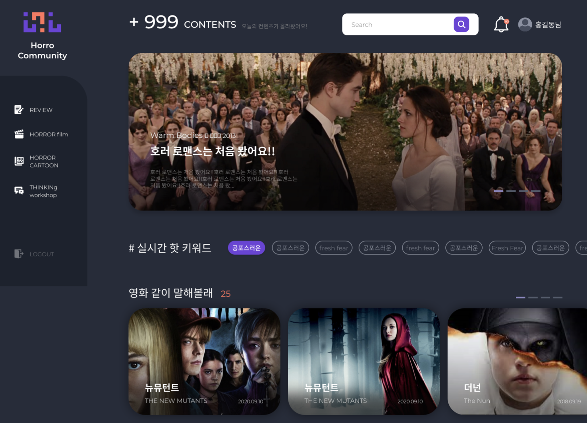

# 666 공포 커뮤니티 기획구상도 - 진행중

## 목적 :

주변에 공포라는 주제에 관련된 영화, 만화, 기타등등을 좋아하는 사람들이 많이 없기 때문에
항상 관련된 정보등의 주제로 대화를 하고 싶어도 어려운 경우가 많았습니다.
그래서 직접 공포를 좋아하는 사람들의 모임을 만들어보고 싶었습니다.
그렇지만 너무 범위를 크게 하는것에는 한계가 있기에 영화라는 컨셉으로 제한두었습니다.

**사실 이 사이트는 언젠가 풀스택을 할줄안다면 직접 운영해보고 싶은 사이트이나 현재는 포트폴리오라는 우선순위를 앞두어 한계점을 배제한 후 진행될 예정입니다.**

## 1차 디자인 컨셉 :



## 초기 환경셋팅 :

### 1. 폴더 트리 구조

```jsx
├── pages
│ ├── home
│ └── review
│ └── movies
│ └── community
├── components
│ ├── shared
│ ├── auth // fifebase 로그인 관련 컴포넌트
│ ├── home
│ ├── review
│ ├── movies
│ ├── community
├── assets
│ ├── images
│ ├── data // 테스트를 위한 임시 데이터 및 정적 데이터
├── api
│ ├── mock
├── utils
├── context
│ ├── auth // 로그인의 대한 상태를 전역에서 관리할수 있도록 셋팅
│ ├── modal // 모달에 대한 상태를 전역에서 관리할 수 있도록 셋팅
```

### 2. 제작환경 예정 라이브러리

1. swiper : 디자인 컨셉상 슬라이드가 많이 들어갈 예정이므로 슬라이드 라이브러리를 추가할 예정입니다. naver가 제공하는 flicking과 swiper중 고민하다 자주 사용되기에 사용이 더 간편하면서도 무겁지않은 swiper를 선택하였습니다.

2. react-icons : 사이트에 사용될 아이콘들을 위해 사용될 예정입니다.

3. react router : 싱글페이지가 아닌 프로젝트이므로 라우터가 당연시 적용됩니다.

4. storybook : 처음 프로젝트는 포트폴리오의 목적에 부합하는 과정이므로 처음 접하는 분들에게 좀더 다가가기 쉬운 목적을 두고있습니다. 해당 프로젝트가 어떠한 컴포넌트로 유지되며 좀더 친절할 목적을 두기위해 함께 진행될 예정입니다.

5. Lint & prettier : 전체적인 코드품질과 가독성을 위해 사용될 예정입니다.

6. scss : css를 대신하여 styled components와 scss를 고민하였으나 전반적으로 길이가 길어질 부분이 예상되어
   모듈화로 분리시키기 쉬운 scss를 선택하였습니다.

7. classnames : scss와 함께 사용하기 쉬운 라이브러리이며 class 사용성을 극대화 하기 위하여 사용될 예정입니다.

## 프로젝트 기본 컴포넌트 구상 :

현재 리스트에 대한 상세정보는 하단 각 페이지, 컴포넌트별 정리본을 참조드리겠습니다.

- Home : 메인페이지
- Review : 일반 갤러리 게시글의 공포영화에 대한 리뷰 게시페이지입니다.
- Horror Movies : 공포영화들의 리스트 입니다.
- Community : 커뮤니티 페이지이며 서브 페이지로 with Talk, with Watch, Question으로 구분될 예정입니다.
- Search : 검색 결과 페이지입니다.
- Login / Logout / Sign in : firebase를 이용하여 로그인 기능을 구현할 예정입니다.

## 사용될 api

1. the movie DataBase : 네이버영화 api, 영화진흥회 api를 알아보았으나 각 단점들이 존재하여 더욱 친절한 api를 찾는 과정에서 movie db를 찾게되었습니다. 고로 해당 api를 사용할 예정입니다.

## 로그인 및 게시판 DB기능

firebase auth를 이용하여 로그인, 회원가입, 프로필데이터를 추가할 예정입니다 <br />.
DB가 필요한 게시판(리뷰, 커뮤니티)는 firebase.database를 활용할 예정입니다.

### 로그인

signInWithEmailAndPassword를 이용하여 가입된 이메일과 비밀번호로 로그인을 제공합니다.
로그인 후 router의 useNavigation을 활용하여 원하는 페이지로 라우팅합니다.

**로그인 에러코드**

1. auth/wrong-password : 잘못된 비밀번호
2. auth/user-not-found : 찾을수없는 유저
3. auth/invalid-email : 잘못된 형식 으로 구분합니다.

### 회원가입 및 프로필데이터

이메일과 비밀번호, 비밀번호 체크, 닉네임 정보 기준으로 가입을 합니다.
firebase auth의 createUserWithEmailAndPassword, updateProfile를 import하여 활용을 합니다.
에러 코드로는

1. 비밀번호 동일 체크
2. auth/email-already-in-use : 사용중인 이메일값
3. auth/invalid-email : 사용에 적합하지 않는 이메일 형태

### 게시판 DB

getFirestore를 import하여 원하는 제공 레퍼런스를 활용합니다.
데이터 작성(입력)방식은 각 게시글의 ID가 랜덤값인지 또는 지정값인지의 차이에 따라
셋방식이 달라집니다.
이번 컨셉에는 지정된 ID값이 필요하기 때문에 doc, setDoc를 import하여 진행합니다.
id값 같은 경우는 유저의 uid정보와 date.now()의 값을 기준으로 지정하였습니다.
이미지데이터의 경우에는 uuid npm을 활용하여 사용해도 좋을듯합니다.

등록된 데이터는 읽는 과정에서는 리스트페이지와 디테일 페이지의 약간의 차이가 있습니다.
리스트페이지에는 비동기 collection 이후 foreach 순환을 돌며
state의 배열에 필요값들을 추가한 후 map랜더링 하였으며

배열의 값이 아닌 하나의 디테일 데이터는
id값을 기준으로 getDocs를 활용하여 데이터를 처리하였습니다.

**정리**

- firebase를 활용하여 auth, database를 진행하였습니다.
- 회원가입은 createUserWithEmailAndPassword
- 프로필은 updateProfile를
- 로그인은 signInWithEmailAndPassword
- DB post는 id값의 자동화 지정화의 따라 나뉘는데 이번 프로젝트는 setDocs를 활용한 지정화
- DB get은 id값을 기준으로 getDocs

## movies

...진행중

## Home

### 1. MainBanner - Carousel / 메인배너 캐로셀 <br />

review DB의 값들중 랜덤 배열 6가지를 데이터를 props전달을 합니다.
캐로셀은 swiper 라이브러리를 활용하여 제작하였습니다.

...이후 진행중

현재 개인사정으로 인하여 다른 프로젝트 완료 이후 진행될 예정입니다.
