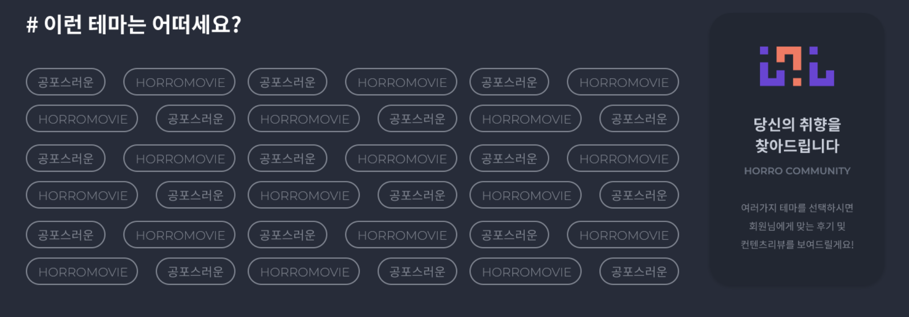

# 666 공포 커뮤니티 기획구상도 - 진행중

## 목적 :

주변에 공포라는 주제에 관련된 영화, 만화, 기타등등을 좋아하는 사람들이 많이 없기 때문에
항상 관련된 정보등의 주제로 대화를 하고 싶어도 어려운 경우가 많았습니다.
그래서 직접 공포를 좋아하는 사람들의 모임을 만들어보고 싶었습니다.
그렇지만 너무 범위를 크게 하는것에는 한계가 있기에 영화라는 컨셉으로 제한두었습니다.

**사실 이 사이트는 언젠가 풀스택을 할줄안다면 직접 운영해보고 싶은 사이트이나 현재는 포트폴리오라는 우선순위를 앞두어 한계점을 배제한 후 진행될 예정입니다.**

## 컨셉 :

공포영화를 같이보고싶거나 함께 관련 분야에 대하여 대화를 원하는 사람들의 커뮤니티입니다.
하지만 디자인컨셉은 너무 공포스럽지않도록 처음 사이트에 접한 공포를 싫어하는 사람들에게도 다가가기 쉬운 디자인으로 목적을 두었습니다.

## 1차 디자인 컨셉 :


## 초기 환경셋팅 :

### 1. 폴더 트리 구조

```jsx
├── pages
│ ├── home
│ └── review
│ └── movies
│ └── community
├── components
│ ├── shared
│ ├── home
│ ├── review
│ ├── movies
│ ├── community
├── assets
│ ├── images
│ ├── data // temp data for test
├── api
│ ├── mock
├── utils
```

### 2. 제작환경 예정 라이브러리

1. swiper : 디자인 컨셉상 슬라이드가 많이 들어갈 예정이므로 슬라이드 라이브러리를 추가할 예정입니다. naver가 제공하는 flicking과 swiper중 고민하다 자주 사용되기에 사용이 더 간편하면서도 무겁지않은 swiper를 선택하였습니다.

2. react-icons : 사이트에 사용될 아이콘들을 위해 사용될 예정입니다.

3. react router : 싱글페이지가 아닌 프로젝트이므로 라우터가 당연시 적용됩니다.

4. storybook : 처음 프로젝트는 포트폴리오의 목적에 부합하는 과정이므로 처음 접하는 분들에게 좀더 다가가기 쉬운 목적을 두고있습니다. 해당 프로젝트가 어떠한 컴포넌트로 유지되며 좀더 친절할 목적을 두기위해 함께 진행될 예정입니다.

5. Lint & prettier : 전체적인 코드품질과 가독성을 위해 사용될 예정입니다.

6. scss : css를 대신하여 styled components와 scss를 고민하였으나 전반적으로 길이가 길어질 부분이 예상되어
   모듈화로 분리시키기 쉬운 scss를 선택하였습니다.

7. classnames : scss와 함께 사용하기 쉬운 라이브러리이며 class 사용성을 극대화 하기 위하여 사용될 예정입니다.

## 프로젝트 기본 컴포넌트 구상 :

현재 리스트에 대한 상세정보는 하단 각 페이지, 컴포넌트별 정리본을 참조드리겠습니다.

- Home : 메인페이지
- Review : 일반 갤러리 게시글의 공포영화에 대한 리뷰 게시페이지입니다.
- Horror Movies : 공포영화들의 리스트 입니다.
- Community : 커뮤니티 페이지이며 서브 페이지로 with Talk, with Watch, Question으로 구분될 예정입니다.
- Search : 검색 결과 페이지입니다.
- Login / Logout / Sign in : firebase를 이용하여 로그인 기능을 구현할 예정입니다.

## 사용될 api

1. the movie DataBase : 네이버영화 api, 영화진흥회 api를 알아보았으나 각 단점들이 존재하여 더욱 친절한 api를 찾는 과정에서 movie db를 찾게되었습니다. 고로 해당 api를 사용할 예정입니다.

2. json-server(X) : 리뷰, 커뮤니티등의 사용될 목적의 api입니다. 해당 프로젝트만을 위해 사용될 가상의 json입니다.
   로그인 기능에도 사용할지 현재 고민중입니다.<br />
   
   -> firebase의 기능에 대하여 알게된 후 json-server대신 firebase를 활용하여 로그인, 리뷰와 커뮤니티에 사용될 데이터베이스를 구현할 예정입니다.

## 페이지별 구상기획 1 (Page -> Auth)

### Login / 로그인 <br />

**컨셉** : <br />
firebase를 이용하여 로그인 기능을 구현할 예정입니다.

**구현** : <br />

**문제사항** : <br />

## 페이지별 구상기획 2 (Page -> Home)

### 1. MainVisual - Carousel / 메인비주얼 캐로셀 <br />

**컨셉** : <br />
초기 컨셉은 리뷰페이지에서 좋아요를 많이 받은 게시글의 순위를 가져올 예정이었으나, 좋아요기능의 운영 유지가 어려운 한계가 있어 좀더 포트폴리오 목적에 순위를 둔 기능으로 계획을 변경하였습니다.
직접 제작한 리뷰페이지의 데이터에서 랜덤값의 6개의 데이터를 노출시킬 예정입니다.

**구현** : <br />

**문제사항** : <br />

### 2. HotKeywod - Carousel / 따끈따끈 키워드 <br />

**컨셉** : <br />
api에서 제공해주는 keyword 기능을 이용하여 해당 키워드 리스트별을 나열하여 선택된 키워드 관련 영화를 보여줄 예정입니다.
**키워드 중복선택에 대한 부분은 테마로 분류하여 아래 테마 컴포넌트에서 제공할 예정입니다.**

**구현** : <br />

**문제사항** : <br />

### 3. With Talk about Horror movies - Carousel / 영화 같이 말해볼래? <br />

**컨셉** : <br />
**최근 개봉된 영화순서대로 나열할 예정입니다.** <br />
**해당 페이지는 커뮤니티페이지의 서브페이지입니다. 리뷰페이지와는 다른 페이지입니다.** <br />
**리뷰페이지는 개인의 게시글을 올릴수있으며 with talk페이지는 선택된 영화페이지에서 댓글형식으로 리뷰를 작성할 수 있습니다.** <br />

각 공포영화들의 갤러리 형식의 게시판이며 선택된 영화의 디테일 페이지에서는
해당 영화의 토론 및 이야기를 할 수 있습니다.

**구현** : <br />

**문제사항** : <br />

### 4. Random review & Popularity Ranking / 랜덤리뷰와 인기 공포영화 순위 <br />

**컨셉** : <br />
랜덤으로 단일 리뷰데이터를 읽어와 랜더링 하는것과 함께 사이드에는
movie api에서 제공하는 인기순 랭킹으로 공포영화의 순위를 제공할 예정입니다.

**구현** : <br />

**문제사항** : <br />

### 5. With View - Carousel / 무섭지만 같이봐요! <br />

**컨셉** : <br />
처음 이 사이트의 컨셉을 기획하기전부터 넣고싶었던 기능입니다.
갤러리 형식의 커뮤니티 공간이며 혼자 영화를 보고싶지않는 혹은 무서워서 혼자 보지못할분들을 위한
취지에 부합하시는 분들과 함께 영화를 볼수있고 활동하는 커뮤니티 공간입니다.
이부분은 movie DB의 api가 아닌 사이트의 컨셉상 따로 만든 json을 불러와 페이지를 구성할 예정입니다.

**구현** : <br />

**문제사항** : <br />

### 6. Question / 생각공작소 #질문방 <br />

**컨셉** : <br />
With View와 비슷한 커뮤니티 공간이며 갤러리 형식이 아닌 일반 게시글 형식의 커뮤니티 공간으로 제작될 예정입니다. 영화시청후 궁금한 부분과 의논을 나누고 싶은 공간입니다.
현재는 운영이 어려운 취지상 이또한 따로 제작한 json의 데이터를 읽어올 예정입니다.

**구현** : <br />

**문제사항** : <br />

### 7. How about this theme? / 이런 테마는 어떠세요? <br />

**컨셉** : <br />
movies 페이지에서 나열할 모든 공포영화의 키워드들의 중복값을 뺀 후 해당 배열을 나열하여 선택된 키워드에 부합하는 영화를 안내할 예정입니다.

현재 예상 디자인으로는

위 형식과 같은 키워드들의 나열들을 n개 이상 클릭하면 사이드 공간에
찾아보기 버튼이 랜더링되며 관련된 영화의 리스트들을 찾을수 있도록 할 예정입니다.

**구현** : <br />

**문제사항** : <br />
